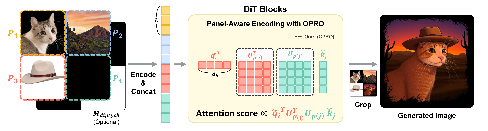
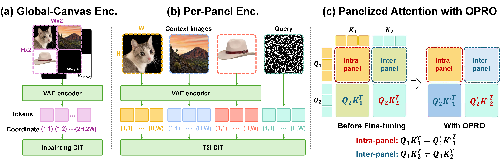
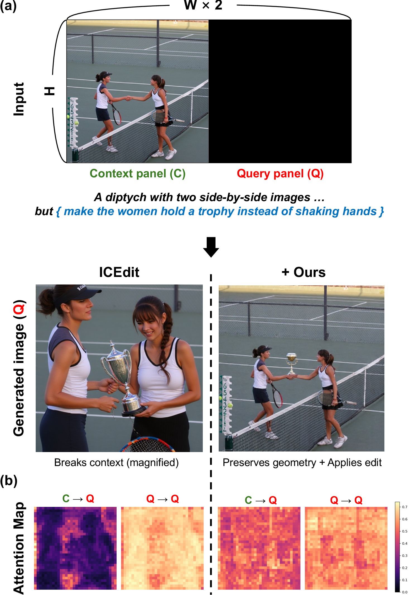
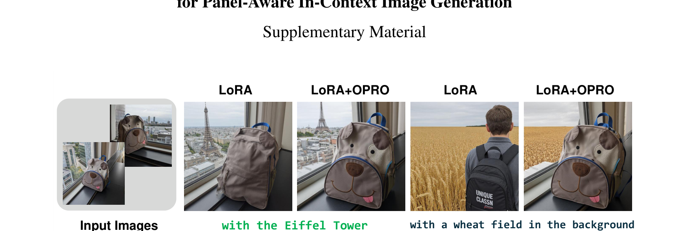
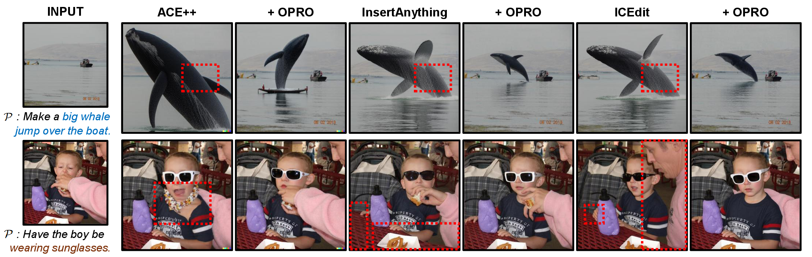
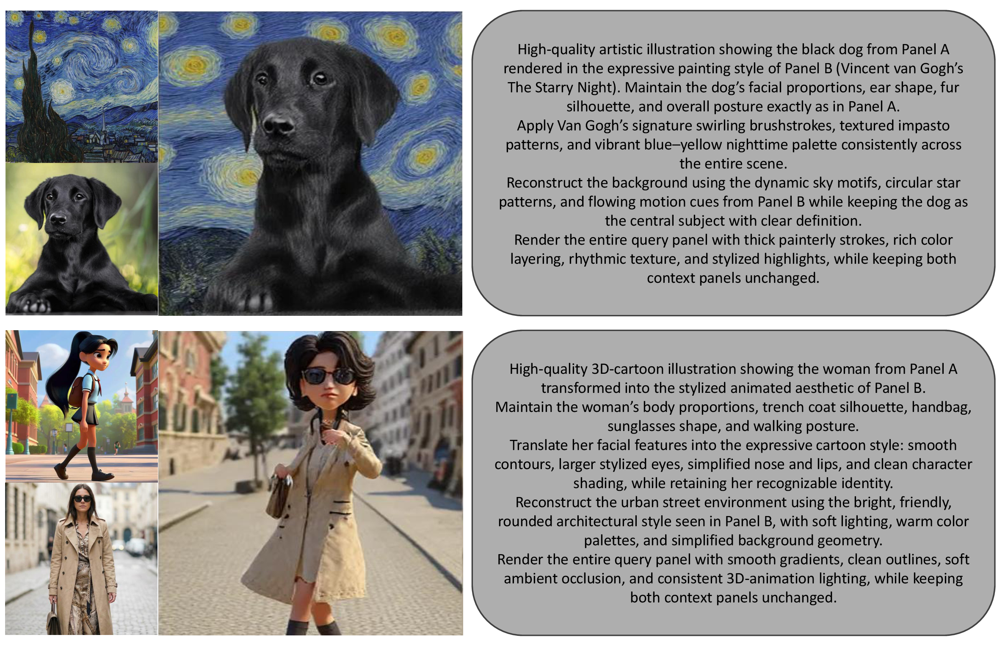
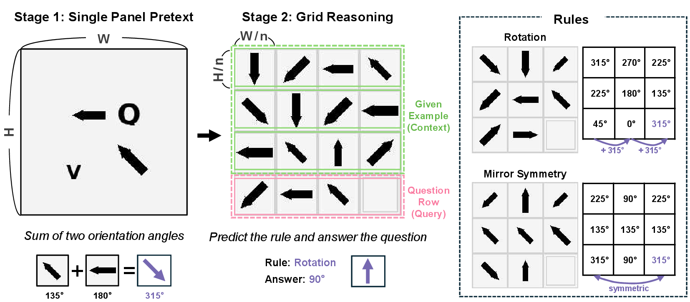
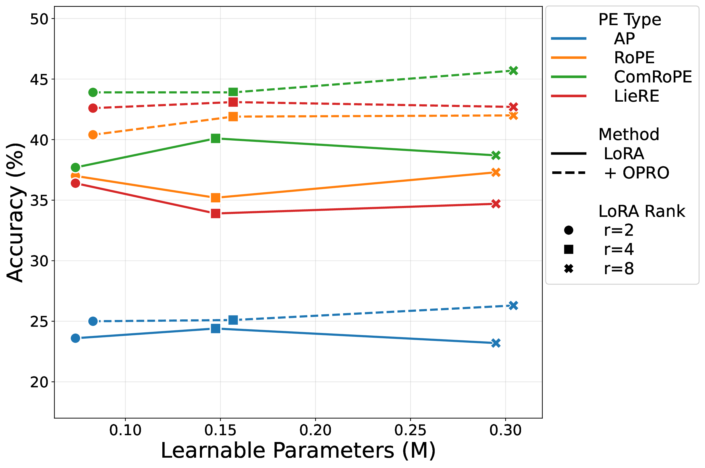
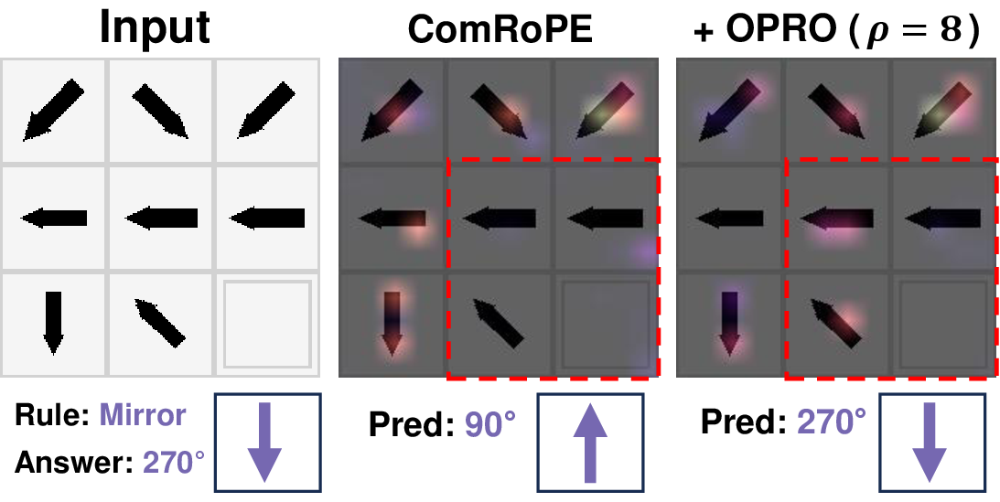
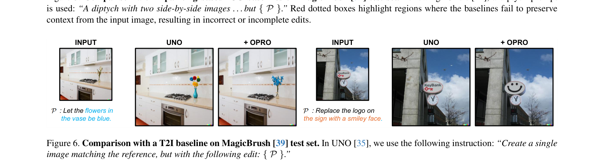

# OPRO &mdash; Orthogonal Panel-Relative Operators (CVPR 2026)

[](https://arxiv.org/abs/2603.27637)
[](https://arxiv.org/abs/2603.27637)
[](LICENSE)
[](pyproject.toml)
[](#)

> **OPRO: Orthogonal Panel-Relative Operators for Panel-Aware In-Context Image Generation**
>
> Sanghyeon Lee, Minwoo Lee, Euijin Shin, Kangyeol Kim, Seunghwan Choi, Jaegul Choo
> Korea Advanced Institute of Science and Technology (KAIST)
>
> [arXiv](https://arxiv.org/abs/2603.27637) &middot; Project page (TBD) &middot; [BibTeX](#bibtex)



OPRO is a **+0.93 M parameter** adapter that attaches a learnable,
panel-specific orthogonal operator on top of any backbone&apos;s frozen
position-aware queries and keys. It exactly preserves the same-panel
attention scores of the backbone (Proposition 2) and feature norms
(Proposition 1), so it concentrates all of its capacity on inter-panel
modulation.

## Why panel-relative?



Tiled in-context generation pipelines come in two flavours: a single
*global-canvas* coordinate grid (inpainting DiTs), or *per-panel* local
frames fused through attention (T2I DiTs). Both stay panel-agnostic at the
attention level &mdash; the adapter has to simultaneously learn inter-panel
transfer **and** preserve intra-panel synthesis. OPRO decouples the two:
panel-specific orthogonal rotations modulate the off-diagonal blocks of
attention while leaving the diagonal blocks bit-identical to the
pre-trained backbone.



> Concrete failure mode that motivates OPRO. Given a side-by-side
> diptych (context panel C + query panel Q) and the instruction
> *&ldquo;make the women hold a trophy instead of shaking hands&rdquo;*,
> the ICEdit baseline leaks context geometry into the query, while
> **+ Ours** preserves panel geometry and applies the edit. The
> attention maps below show why: under OPRO the C&rarr;Q and
> Q&rarr;Q blocks become cleanly separable.

The release contains four self-contained tracks:

| Track | What | Where |
|---|---|---|
| **Module** | Standalone OPRO that drops into any attention block | [`opro/`](opro) |
| **A. Reference** | Plain FluxFill + LoRA + OPRO on DreamBooth (3-panel) | [`dreambooth_fluxfill/`](dreambooth_fluxfill) |
| **B. Reproduction** | ICEdit wrapper + joint LoRA+OPRO ckpt on HF | [`instructional_editing/`](instructional_editing) |
| **C. Benchmark** | 2-stage compositional reasoning, 4 PE backbones | [`compositional_reasoning/`](compositional_reasoning) |
| **D. Plug-ins** | Patches for ACE++, InsertAnything, UNO | [`integrations/`](integrations) |

---

## Install

```bash
git clone https://github.com/niceDuckgu/OPRO && cd OPRO
pip install -r requirements.txt
```

For the Track A / B / D scripts that touch FluxFill you also need
`diffusers`, `peft`, and a local FLUX.1-Fill-dev checkpoint &mdash; see
the per-track READMEs.

---

## Quick start: 5-line OPRO

```python
import torch
from opro import OPROLieLowRank

opro = OPROLieLowRank(num_panels=2, head_dim=128, rank=32)

# After your attention layer applies positional encoding to Q, K:
q, k = ...                                            # [B, H, S, d_h]
panel_ids = torch.cat([torch.zeros(64), torch.ones(64)]).long().unsqueeze(0)
q_rot, k_rot = opro.apply_to_qk(q, k, panel_ids)      # same shape, same norm
```

`opro.OPROLieLowRank` ships four variants:

* `variant="opro"` &mdash; main method (Sec. 3.2); same `U` on Q and K.
* `variant="opro_bd"` &mdash; block-diagonal RoPE-aligned (Supp. Sec. B). *(Use `OPROBlockDiagonal` directly.)*
* `variant="abl1"` &mdash; Additive Panel Bias ablation (Tab. 2).
* `variant="abl2"` &mdash; Asymmetric Q/K ablation (Tab. 2).

Plus `symmetric_init=True` for the &ldquo;OPRO w/o Zero Init&rdquo; ablation.

---

## Track A &mdash; Plain FluxFill + DreamBooth (3-panel)

A minimal training template that doesn&apos;t depend on ICEdit / ACE++.
Use this as a starting point when integrating OPRO into your own
pipeline.



> Supp. Fig. 1: 3-panel DreamBooth — two reference panels + one masked
> target. OPRO recovers subject identity (ear shape, fur pattern) more
> faithfully under cross-panel transfer.

```bash
python -m dreambooth_fluxfill.train \
    --config dreambooth_fluxfill/config.yaml \
    --flux_path /path/to/FLUX.1-Fill-dev \
    --data_root /path/to/dreambooth
```

---

## Track B &mdash; Instructional editing on ICEdit



> Fig. 5: Adding OPRO consistently sharpens the edit, removes context
> leakage (red boxes), and improves identity preservation across three
> different inpainting-based ICG baselines.

We do **not** vendor ICEdit. Clone it, then use our wrapper:

```bash
git clone https://github.com/River-Zhang/ICEdit /your/icedit
huggingface-cli download <ORG>/opro-icedit-magicbrush --local-dir ./ckpts/opro_icedit

python -m instructional_editing.wrapper \
    --icedit_path /your/icedit \
    --flux_path /path/to/FLUX.1-Fill-dev \
    --ckpt_dir ./ckpts/opro_icedit \
    --image source.png --instruction "Make the cat wear sunglasses" \
    --out edited.png
```

The HF Hub repo bundles **both** the LoRA *and* the OPRO weights because
they were trained jointly. See [`instructional_editing/README.md`](instructional_editing/README.md).


> OPRO covers object replacement, attribute modification, text
> rendering, and global style transfer while keeping the rest of
> the original image untouched.



> Multi-reference compositional generation emerges without
> explicit training on multi-reference layouts: style is taken
> from one context panel, the object from another, and the query
> panel is rendered consistently.

---

## Track C &mdash; Two-stage controlled benchmark



> Fig. 3: Synthetic Raven-style benchmark to study OPRO in isolation.
> Stage 1 trains intra-panel arrow perception; Stage 2 freezes the
> backbone and asks the adapter to learn an inter-panel rule (rotation
> by `k·45°` or vertical mirror) from the first `n−1` panels per row.

```bash
# Stage 1 (single-panel pretext, 50k steps)
python -m compositional_reasoning.train \
    --stage 1 --pos_type rope --size base --output_dir ./out/stage1

# Stage 2 (grid reasoning, freeze backbone + train LoRA + OPRO, 2k steps)
python -m compositional_reasoning.train \
    --stage 2 --pos_type rope --grid_size 3 \
    --pretrain_ckpt out/stage1/best.pt \
    --use_lora --use_opro --opro_variant opro \
    --freeze_backbone --output_dir ./out/stage2
```

`--pos_type` accepts `ape | rope | liere | comrope`. `--opro_variant`
accepts `opro | opro_bd | abl1 | abl2`. Combine with
`--opro_symmetric_init` if you want the &ldquo;w/o Zero Init&rdquo;
ablation.



> OPRO&apos;s impact on parameter efficiency. Validation accuracy (%)
> vs. trainable adapter parameters (M) on the 3&times;3 grid task,
> across four positional-encoding backbones (AP / RoPE / ComRoPE /
> LieRE) and LoRA ranks `r=2, 4, 8`.



> The 3&times;3 grid attention rollout for ComRoPE collapses the
> query cell&apos;s attention onto the wrong reference; adding
> OPRO (&rho;=8) re-routes it to the mirror-symmetric reference
> and yields the correct prediction (270&deg;).

---

## Track D &mdash; Plugging OPRO into other baselines



> UNO baseline vs. UNO + OPRO on subject-driven editing. OPRO sharpens
> the requested attribute change (color, logo swap) while leaving the
> rest of the scene intact.

Each subdirectory under [`integrations/`](integrations) ships a
README, a thin `opro_processor.py`, and a `patch.diff` showing the
upstream changes. The integrations are intentionally minimal &mdash; we
do not vendor any baseline.

| Baseline | Pattern |
|---|---|
| ACE++ | inline OPRO call inside `attention_forward` |
| InsertAnything | OPRO context routed through `model_config["_opro_ctx"]` |
| UNO | dual-stream `DoubleStreamBlockOproProcessor` |

---

## Validated end-to-end on FluxFill

The published code was end-to-end validated on a real FluxFill checkpoint
before release (see [`SMOKE_TEST.md`](SMOKE_TEST.md)):

* OPRO zero-init is bit-exact across all 57 attention layers in production.
* A 1,000-step single-subject DreamBooth fine-tune improves DINO
  similarity by **+0.076** vs. LoRA-only.
* The released loader deserialises the paper&apos;s production checkpoint
  unchanged.

Full paper-table reproduction requires GPUs &mdash; follow the per-track
READMEs.

---

## License

[Apache-2.0](LICENSE).

---

## Acknowledgments

This work was supported by IITP grants funded by the Korean government
(MSIT) under No. RS-2019-II190075 (AI Graduate School Program at
KAIST), the National Research Foundation of Korea
(No. RS-2025-00555621), and i-Scream Media. Compute was provided by
the High-Performance Computing Support Project (NIPA grant
No. RQT-25-070278, 40&times; H100 GPUs).

---

<a name="bibtex"></a>

## BibTeX

```bibtex
@inproceedings{lee2026opro,
  title     = {OPRO: Orthogonal Panel-Relative Operators
               for Panel-Aware In-Context Image Generation},
  author    = {Lee, Sanghyeon and Lee, Minwoo and Shin, Euijin and
               Kim, Kangyeol and Choi, Seunghwan and Choo, Jaegul},
  booktitle = {Proceedings of the IEEE/CVF Conference on Computer Vision
               and Pattern Recognition (CVPR)},
  year      = {2026},
}
```
