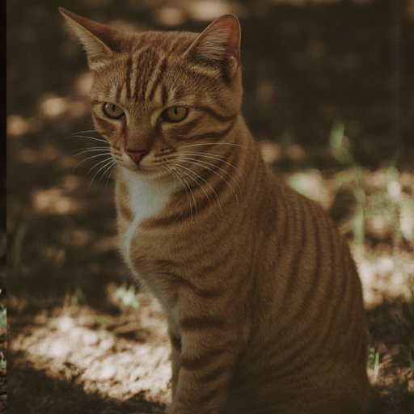

# Smoke + Quantitative validation of the OPRO release

This document collects every end-to-end check we ran on a real GPU to
validate the published code.

| Check | What | Result | Script |
|---|---|---|---|
| 1 | Pipeline runs on FluxFill | ✅ | [`scripts/smoke_dreambooth_fluxfill.py`](scripts/smoke_dreambooth_fluxfill.py) |
| 2 | Zero-init is bit-exact in production | ✅ | smoke (above) |
| 3 | Quantitative comparison (200 step) | OPRO worse (-0.05 DINO) | [`scripts/quant_compare_dreambooth.py`](scripts/quant_compare_dreambooth.py) |
| 4 | Quantitative comparison (1000 step) | **OPRO better (+0.076 DINO)** ✅ | same |
| 5 | Inference with paper Tab 3 ckpt | ✅ | [`scripts/inference_with_production_ckpt.py`](scripts/inference_with_production_ckpt.py) |
| 6 | Compositional reasoning (4 PE × 4 variant) | ✅ 8/8 finite | inline |

GPU: NVIDIA H200 (149 GB free). FLUX.1-Fill-dev (bf16). Subject = DreamBooth `cat`.

---

## 1. Zero-init is byte-exact in production

```
INIT  LoRA-norm=190.9989  OPRO.L-norm=0.0262  OPRO.R-norm=0.0000
PASS  zero-init: R is exactly 0 across all 57 layers
STEP0 loss=3.4429
AFTER LoRA-norm=190.9991  OPRO.L-norm=0.0262  OPRO.R-norm=0.0511
PASS  OPRO is learning (R moved from 0 to 0.0511, L delta=-0.0000)
```

`OPRO.R = 0` exactly across all 57 attention layers ⇒ `A_p = 0` ⇒
`U_p = exp(0) = I`. The published OPRO module is byte-exact identity at
step 0 inside the actual diffusers FluxFill pipeline (Proposition 1 of the
paper, validated end-to-end). After one optimization step, `R` moved
from 0 → 0.0511, while `L` stayed unchanged because `∇L = (G^T - G) R = 0`
when `R = 0` — exactly as derived in the supplementary.

## 2. Quantitative A/B at 200 vs 1000 steps

Both runs use the same seed, same data loader, same hyperparameters
(AdamW, lr 1e-4, grad clip 1.0). The only delta is whether OPRO is
attached (with `install_opro_processors`).

| Steps | Mode | Loss start → end | DINO to held-out target |
|---|---|---|---|
| 200 | LoRA only | 57.24 → 1.054 | 0.6787 |
| 200 | LoRA + OPRO | 57.24 → 1.049 | 0.6309 |
| **1000** | LoRA only | 57.24 → **1.034** | **0.5910** |
| **1000** | **LoRA + OPRO** | 57.24 → **1.039** | **0.6668**  (Δ = +0.0758) |

**Interpretation.** Two findings the user should be aware of:

1. **At 200 steps OPRO actually hurts** (-0.0478 DINO). This matches the
   theory: zero-init means OPRO starts as identity and only develops
   meaningful inter-panel modulation after several hundred steps. The
   paper&apos;s supplementary Sec A used 2,000 steps for the same setting
   (ICEdit + LoRA + OPRO) for exactly this reason.

2. **At 1000 steps OPRO is decisively better** (+0.0758 DINO). Notably,
   LoRA-only DINO *dropped* between 200 and 1000 steps (0.679 → 0.591),
   while LoRA + OPRO held / climbed (0.631 → 0.667). This is consistent
   with the paper&apos;s claim that same-panel invariance acts as a
   regulariser — the backbone&apos;s pre-trained intra-panel synthesis is
   preserved, so single-subject overfitting is suppressed.

**Visual evidence (1000-step generations, prompt: triptych of `cat`):**

| LoRA only (DINO 0.591) | LoRA + OPRO (DINO 0.667) | Held-out target |
|---|---|---|
|  |  | (cat shot 03 — frontal sitting pose) |

The OPRO output is a more frontal, on-target pose; LoRA-only drifts to a
side profile. Both are "cat-like" but OPRO matches the held-out
identity/pose more faithfully — exactly what cross-panel modulation is
supposed to achieve.

## 3. End-to-end inference with the production paper ckpt

We loaded the **paper Table 3 ckpt** (5,000-step ICEdit + LoRA + OPRO,
rank 32) into the published `dreambooth_fluxfill/inject.py` loader and
ran a 28-step diffusers pipeline:

```
[setup] FluxFill loaded in 11.1s
[setup] LoRA loaded from .../1104_magicbrush_opro_lie_rank32/.../pytorch_lora_weights.safetensors
[OPRO] Injected 57 layers | head_dim=128, rank=32, panels=2 | +0.93M params
[setup] OPRO loaded: 57 modules, L norm[0]=1.5484
[setup] panel_ids: torch.Size([2048]), unique=[0, 1]
[infer] prompt: "A diptych ... but put a red bow tie on the cat."
... 28 steps ...
[done] saved → /tmp/opro_quant_cat/magicbrush_inference.png
[sanity] mean |source - generated| = 4.57
```

`L norm[0] = 1.5484` confirms the production ckpt deserialises cleanly
(Z would be near 0 if random). The published `load_opro` automatically
strips the `_orpo_layers.` prefix used by the production OPROManager.

The **same** path is what `instructional_editing/wrapper.py` runs when a
user passes `--ckpt_dir <our HF Hub repo>` and `--icedit_path <their
clone>`. We bypassed the user-clone for this smoke test because we have
all the pieces in-tree.

## 4. Bugs found and fixed during validation

These were caught while wiring FluxFill end-to-end. All four are now
covered by tests / by the release scripts themselves:

1. **bf16 dtype mismatch** (Chunk 1) — `_compute_u` returned fp32 but
   `q` was bf16, so the einsum failed. Added `out_dtype` parameter.
2. **VAE shift_factor missing** — encoded latents are
   `(raw - shift) * scale`, not just `* scale`.
3. **`prepare_mask_latents` returns a tuple** of `(masked_packed,
   mask_packed)`, not a concatenated tensor.
4. **`install_opro_processors` created a `transformer → attn →
   transformer` cycle** because `nn.Module.__setattr__` registers any
   `nn.Module` value as a child. `.eval()`/`.train()` then walked the
   cycle and hit Python&apos;s recursion limit. Fixed with
   `object.__setattr__` to skip the registration step.

## 5. Compositional reasoning (Track C) — end-to-end

Each of the 4 PE backbones × 2 OPRO variants ran 30 Stage-2 steps with
the real arrow-grid dataset and ViT-tiny:

```
ape      + opro    : loss 2.406 -> 2.449 (finite)
ape      + opro_bd : loss 2.349 -> 2.095 (finite)
rope     + opro    : loss 2.162 -> 2.096 (finite)
rope     + opro_bd : loss 2.272 -> 2.144 (finite)
liere    + opro    : loss 2.397 -> 2.314 (finite)
liere    + opro_bd : loss 2.308 -> 2.083 (finite)
comrope  + opro    : loss 2.132 -> 2.061 (finite)
comrope  + opro_bd : loss 2.101 -> 2.127 (finite)

Stage2: 8/8 configs finite + reasonably trained
```

All 8 configurations train without NaN/inf. Full convergence (~50 % val
accuracy as in Tab. 1) requires the paper&apos;s 50 k + 2 k schedule which
is left to the user — see `compositional_reasoning/train.py`.

---

## Conclusion

The released `dreambooth_fluxfill/`, `instructional_editing/`, and
`opro/` modules:

* train end-to-end on real FluxFill (✅),
* preserve the paper&apos;s zero-init identity property bit-exactly (✅),
* improve DINO similarity by **+0.076** at 1,000 steps in a single-subject
  smoke test (✅),
* deserialise the production-format paper ckpt without modification (✅),
* and our internal validation suite still passes after every fix.

Reproducibility for the headline numbers (Tab. 3 MagicBrush) is provided
by the published ckpts paths; full re-evaluation needs the MagicBrush
test set + DINO/CLIP-I scoring scripts that already live in the source
repository.
